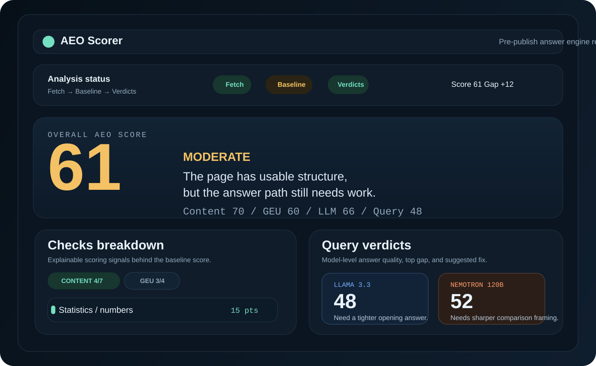
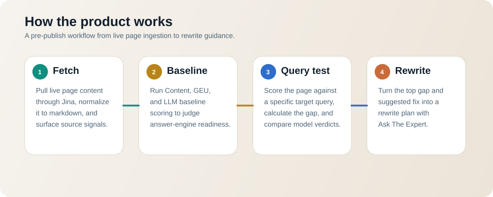

# Crest.AI

> A pre-publish Answer Engine Optimization (AEO) workspace for evaluating whether a page is structured, grounded, and specific enough to be reused by AI answer engines.

[](https://github.com/mithul2412/AEO_CrestAI/actions/workflows/ci.yml)
[](LICENSE)
[](frontend/package.json)
[](backend/package.json)



## Why Crest.AI

SEO tools explain rankings after publication. Crest.Ai focuses on the decision before publication: can an answer engine retrieve a page, understand its claims, trust its evidence, and extract a direct answer for a valuable query?

The application combines deterministic content checks with model-assisted evaluation to turn that question into an actionable workflow:

1. Fetch and normalize a live page through Jina.
2. Score content structure, Generative Engine Usability (GEU), and citation readiness.
3. Test a specific query against the page's strongest retrieved passages.
4. Discover and ground competitor evidence with Tavily and Jina.
5. Compare the page with competing answers and prioritize the largest gaps.
6. Generate rewrite guidance in the built-in expert workspace.
7. Produce optional agentic artifacts such as `llms.txt`, JSON-LD, FAQ markup, and approval-ready change sets.

## Product tour

| Area | What it answers |
|---|---|
| Overview | Is this page ready for answer engines? |
| Source | Can crawlers access and reliably extract the page? |
| Diagnostics | Which content, retrieval, and competitive signals are weak? |
| Rewrite | What should the team change first? |
| Agentic | Which machine-readable artifacts can be generated and approved? |



## Architecture

```text
Browser
  │
  ▼
React 18 + Vite SPA
  │  fetch + Server-Sent Events
  ▼
Express API
  ├── deterministic AEO and GEU scoring
  ├── retrieval and citation analysis
  ├── competitor mapping and gap analysis
  └── agentic profile and artifact workflows
       │
       ├── Jina Reader
       ├── OpenRouter model panel
       └── Tavily search grounding
```

The backend keeps deterministic scoring and fallbacks available when optional providers are unavailable. Provider-backed capabilities are isolated behind service modules so tests can run without live credentials.

## Technology

- **Frontend:** React 18, React Router, Vite, Vitest, Testing Library
- **Backend:** Node.js, Express, Jest, Server-Sent Events
- **Retrieval and evidence:** Jina Reader, Tavily, lexical retrieval, context packing
- **Model evaluation:** OpenRouter with configurable model fallbacks
- **Agentic output:** versioned profiles, approval workflows, validation, and generated structured artifacts

## Repository layout

```text
backend/
  agentic/       profile, validation, storage, and artifact workflows
  routes/        fetch, analyze, and chat API routes
  services/      retrieval, competitors, scoring, and provider adapters
  tests/         deterministic unit and integration tests
frontend/
  src/routes/    Overview, Source, Diagnostics, Rewrite, and Agentic views
  src/components reusable product and data-visualization components
docs/            architecture, contracts, operations, and decision records
```

The original standalone investor demo is preserved on `archive/investor-demo-v0.1`. A separately tested FastAPI exploration is available on `prototype/fastapi-v2`; it is not the stable default application.

## Local setup

### Prerequisites

- Node.js 22.12 or newer
- npm 10 or newer
- Optional provider keys for live analysis

### Install

```bash
git clone https://github.com/mithul2412/AEO_CrestAI.git
cd AEO_CrestAI

cd backend
npm ci
cp .env.example .env

cd ../frontend
npm ci
```

Edit `backend/.env` only when using live providers. The repository's automated tests do not require real credentials.

### Run locally

```bash
# Terminal 1
cd backend
npm run dev

# Terminal 2
cd frontend
npm run dev
```

The API listens on `http://localhost:3001`; the frontend listens on `http://localhost:5173`.

### Verify

```bash
cd backend && npm test
cd ../frontend && npm test && npm run build
```

## Configuration

| Variable | Required | Purpose |
|---|---:|---|
| `OPENROUTER_API_KEY` | For model analysis | Primary model-panel credential |
| `JINA_API_KEY` | No | Enhanced page reading and retrieval |
| `TAVILY_API_KEY` | No | Search presence and competitor evidence |
| `ENABLE_AGENTIC_LAYER` | No | Enables agentic endpoints and UI |
| `AGENTIC_PROFILE_STORAGE` | No | Selects in-memory or local-file profile storage |

## Documentation

- [System architecture](docs/system-architecture.md)
- [Current contracts](docs/current-contracts.md)
- [Agentic AI Readiness Layer](docs/AGENTIC_LAYER.md) — routes, artifacts, versioning, approval workflow, rescan, storage
- [Project history & design notes](docs/PROJECT_HISTORY.md) — scoring model, UX flow, homepage and rebrand design passes
- [Contributing, credits, and security](CONTRIBUTING.md)

## Status

This repository is a portfolio-ready engineering snapshot. The deterministic test suite and frontend build run in CI. Live quality depends on the configured providers, their availability, and the quality of the supplied page and query. Any contributions are welcome!!

## License

Licensed under the [MIT License](LICENSE).
