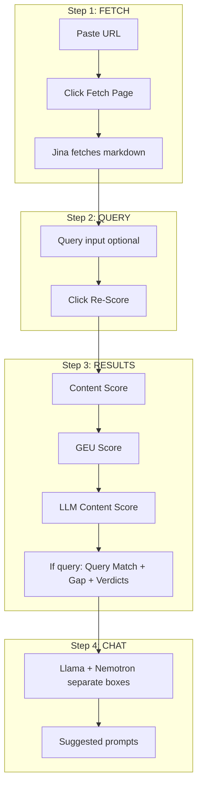

# AEO Pre-Publish Scorer — Design Review Analysis (In-Depth)

## Executive Summary

This document synthesizes the design review, image walkthrough, and codebase analysis to provide a detailed understanding of the AEO Pre-Publish Scorer's current state, flow, and proposed improvements. It maps what the images show, how it aligns with the intended flow, and where gaps exist.

---

## Part 1: Flow Understanding from the Images

### 1.1 Image-by-Image Flow Reconstruction

| Image | Stage | What It Shows | Flow Position |
|-------|-------|---------------|---------------|
| **Homepage (Dark/Light)** | Step 1: FETCH | URL input, "FETCH PAGE" button, 3-step stepper (FETCH active), empty space below | Entry point |
| **Homepage with Feature Cards** | Step 1 (Enhanced) | Same + 3 cards: Multi-Model, Content Gap, AI Expert | Proposed hero section |
| **Query Step** | Step 2: QUERY | Content fetched (100,606 chars), "SEARCH QUERY TO SCORE AGAINST", "SCORE IT" button, page preview | Post-fetch, pre-score |
| **Results Top** | Step 3: RESULTS | Content Score (55), Gap (+0 ALIGNED), Query Match (55), GEU Score (100), CONTENT CHECKS tab | Score display |
| **Results with GEU** | Step 3: RESULTS | GEU CHECKS 4/4 passed, individual check breakdown | Detailed checks |
| **Results with Overall Score** | Step 3: RESULTS | OVERALL AEO SCORE 54/100 MODERATE, HIGH GAP (+27), Content 45, Query Match 18, GEU 100 | Hero score + gap |
| **Model Verdicts** | Step 3: RESULTS | Llama 3.3 + Nemotron 120B side-by-side cards, verdict, GAP, MED/RED indicators | LLM judgment |
| **Expert Chat** | Step 3: CHAT | ASK THE EXPERT, AEO EXPERT CHAT, NEMOTRON 120B + LLAMA 3.3, ASK ANYTHING, suggested prompts | Post-results chat |

### 1.2 Intended User Flow (Derived from Images)

```
┌─────────────────────────────────────────────────────────────────────────────────┐
│  STEP 1: FETCH                                                                  │
│  • User pastes URL (e.g. https://www.t-mobile.com/home-internet)               │
│  • Clicks "FETCH PAGE"                                                          │
│  • Jina fetches content → markdown streamed                                     │
│  • Content preview shown (char count, optional expand)                           │
└─────────────────────────────────────────────────────────────────────────────────┘
                                    │
                                    ▼
┌─────────────────────────────────────────────────────────────────────────────────┐
│  STEP 2: QUERY                                                                  │
│  • User sees "SEARCH QUERY TO SCORE AGAINST" input                              │
│  • Enters query (e.g. "reliable 5G wireless home internet")                     │
│  • Clicks "SCORE IT" (or "Re-Score with Query")                                 │
│  • Query is optional; if omitted, scores are content-only                        │
└─────────────────────────────────────────────────────────────────────────────────┘
                                    │
                                    ▼
┌─────────────────────────────────────────────────────────────────────────────────┐
│  STEP 3: RESULTS                                                                │
│  • Content Score (rule-based, Princeton KDD)                                     │
│  • GEU Score (rule-based, AutoGEO)                                              │
│  • LLM Content Score (AI baseline, no query)                                    │
│  • If query: Query Match Score, Gap, Model Verdicts (Llama + Nemotron)           │
│  • Checks breakdown (Content Checks / GEU Checks tabs)                           │
└─────────────────────────────────────────────────────────────────────────────────┘
                                    │
                                    ▼
┌─────────────────────────────────────────────────────────────────────────────────┐
│  STEP 4: CHAT                                                                   │
│  • AEO EXPERT CHAT powered by NEMOTRON 120B + LLAMA 3.3                         │
│  • Llama and Nemotron in separate boxes (not compare toggle)                     │
│  • Suggested prompts: "How do I improve my query match?", "What's the biggest    │
│    content gap?", "What structured data is missing?"                             │
└─────────────────────────────────────────────────────────────────────────────────┘
```

### 1.3 Key Visual Elements from Images

| Element | Description | Purpose |
|---------|-------------|---------|
| **Stepper** | FETCH → QUERY → RESULTS with green checkmarks when done | Orients user; shows progress |
| **Score rings** | Circular gauges with SVG fill (Content, Query Match, GEU) | Primary score visualization |
| **Gap indicator** | "+0 ALIGNED" or "+27 HIGH GAP" | Hero metric: Content − Query Match |
| **Model verdict cards** | Side-by-side Llama + Nemotron cards | Per-model judgment on query relevance |
| **GAP sections** | Orange-highlighted boxes in verdict cards | Content deficiencies identified by LLM |
| **Content checks** | 7 checks with pass/fail, scores, lift labels | Granular Content Score breakdown |
| **GEU checks** | 4 checks with pass/fail | Granular GEU Score breakdown |
| **Chat** | ASK ANYTHING, suggested prompts, SEND button | Follow-up expert analysis |

---

## Part 2: Design Review — Alignment with Images

### 2.1 What the Design Review Says vs. What Images Show

| Design Review Point | Image Evidence | Assessment |
|---------------------|----------------|-------------|
| **Homepage ~70% empty** | Dark/light homepage images show large blank area below URL input | Confirmed |
| **Button color inconsistency** | FETCH PAGE = lime green; SCORE IT = salmon/orange in some views; SEND = lime green | Confirmed |
| **Page preview too vertical** | Query step image shows full page preview pushing query below fold | Confirmed |
| **Results need hierarchy** | Score rings, verdicts, chat stack with similar weight; no clear "hero" score | Confirmed |
| **Stepper not sticky** | Long scroll loses stepper context | Confirmed |
| **Light mode washed out** | Light mode uses beige/cream; green becomes olive | Confirmed |
| **Empty chat lifeless** | "ASK ANYTHING" large muted text; some images show suggested prompts | Partially addressed |
| **Mobile responsiveness** | Layout may break on narrow screens | Not visible in images |

### 2.2 Typography and Fonts

- **Design review:** "Unbounded + IBM Plex Mono pairing"
- **Codebase:** `index.css` uses `IBM Plex Mono` and `Outfit` for UI
- **Gap:** Unbounded may be a design aspiration; current code uses Outfit. Worth confirming.

### 2.3 Color Palette

**Dark mode (from code):**
- `--accent`: `#d7ff67` (lime green)
- `--model-a`: `#7ab7ff` (blue)
- `--model-b`: `#c895ff` (purple)

**Light mode (from code):**
- `--accent`: `#5f6bff` (indigo)
- Background: `#f7f8fb`

**Design review suggestion:** Light mode should use crisp white (#FAFAFA) and richer green (#00C853) instead of olive.

---

## Part 3: Flow Gaps vs. Codebase

### 3.1 Current Implementation vs. Image Flow

| Flow Element | Image Expectation | Current Code | Gap |
|--------------|-------------------|--------------|-----|
| **Baseline auto-run** | After fetch, scores appear | `handleFetchComplete` → `handleBaselineAnalyze` | Matches |
| **Query optional** | Can skip query for content-only | `/analyze` with no query returns Content + GEU + LLM | Matches |
| **Score display** | Content, GEU, LLM, Query Match, Gap | ScoreDisplay + Verdicts | Matches |
| **Model verdicts** | Llama + Nemotron in separate cards | Verdicts component, side-by-side | Matches |
| **Chat visibility** | Always after results | Chat only when `results` exists | **Gap:** Chat hidden until Re-Score |
| **Chat layout** | Llama + Nemotron in separate boxes, no compare | Chat has Compare/Llama/Nemotron toggle | **Gap:** Should remove toggle |
| **Overall AEO score** | Some images show "54/100 MODERATE" hero | Not in current ScoreDisplay | **Gap:** Missing hero score |
| **Feature cards** | Some images show Multi-Model, Content Gap, AI Expert | Not in current App | **Gap:** Missing hero section |

### 3.2 Button Labels

- **Images:** "FETCH PAGE", "SCORE IT", "SEND"
- **Code:** "Fetch Page", "Re-Score with Query", "Send"
- **Note:** "SCORE IT" vs "Re-Score with Query" — images imply a single "Score" action; code uses "Re-Score" because baseline runs automatically. Semantics: baseline = auto-run; query = optional Re-Score.

---

## Part 4: In-Depth Analysis of Each Design Section

### 4.1 Homepage (Step 1)

**What works:**
- Clear stepper (FETCH active)
- URL input + FETCH PAGE button
- Dark/light mode toggle
- Tagline: "Score content against a specific query – the way AI engines actually retrieve"

**What's missing:**
- Hero illustration or animated graphic
- Feature cards (Multi-Model, Content Gap, AI Expert)
- Animated gradient or mesh background
- Any sense of "what happens next"

**Recommendation:** Add 3 feature cards below the input. Use a subtle gradient or mesh behind the header. Consider a small animated illustration (e.g., content being scored).

### 4.2 Query Step (Step 2)

**What works:**
- Content fetched section with char count
- Query input
- "SCORE IT" / "Re-Score with Query" button

**What's problematic:**
- Page preview (raw markdown) takes too much vertical space
- Query input below the fold on many screens

**Recommendation:** Collapse preview by default. Show "Show preview" toggle. Or use compact metadata bar (title, char count) instead of full preview.

### 4.3 Results Section (Step 3)

**What works:**
- Score rings (Content, Query Match, GEU)
- Gap indicator (ALIGNED / HIGH GAP)
- Content checks + GEU checks tabs
- Model verdict cards (Llama, Nemotron) with verdict, GAP, suggested fix

**What's missing:**
- Overall AEO score hero number (e.g., 54/100 MODERATE)
- Section headings with icons
- Clear visual hierarchy

**Recommendation:** Add large overall score at top. Use distinct color-coded borders for verdict cards. Add section icons.

### 4.4 Chat Section

**What works:**
- ASK THE EXPERT heading
- AEO EXPERT CHAT with model indicator
- Suggested prompts (e.g., "How do I improve my query match score?")
- Input + SEND button

**What's problematic:**
- Chat only shows after Re-Score (should show after fetch)
- Compare/Llama/Nemotron toggle — user wants both in separate boxes always, no toggle

**Recommendation:** Show Chat when `markdown` exists. Remove view toggle. Always render Llama and Nemotron in separate stacked cards.

### 4.5 Sticky Stepper

**Problem:** Long page loses stepper context.

**Recommendation:** Make stepper sticky with `position: sticky; top: 0`. Add frosted glass backdrop. Add smooth-scroll to sections when clicking completed steps.

---

## Part 5: Priority Implementation Summary

| Priority | Change | Files | Effort |
|----------|--------|-------|--------|
| **P0** | Button color consistency (all primary = accent) | `index.css`, components | Low |
| **P0** | Make page preview collapsible (default collapsed) | `UrlInput.jsx` | Low |
| **P0** | Chat visibility (show when markdown exists) | `App.jsx` | Low |
| **P0** | Chat: remove Compare toggle, always show both models | `Chat.jsx` | Low |
| **P1** | Sticky stepper with glass effect | `App.jsx`, `index.css` | Medium |
| **P1** | Hero/feature cards on landing | `App.jsx` | Medium |
| **P1** | Light mode polish (white bg, richer green) | `index.css` | Low |
| **P2** | Overall AEO score hero number | `ScoreDisplay.jsx` | Medium |
| **P2** | Mobile responsiveness | `index.css` | Medium |
| **P3** | Micro-interactions (favicon, particles) | Various | Medium |

---

## Part 6: Flow Diagram (Final)



---

## Part 7: Conclusion

The images and design review paint a coherent picture of the AEO Pre-Publish Scorer:

1. **Flow is clear:** fetch → query (optional) → score → chat.
2. **No-query mode is supported:** content-only scores (scoring algo + LLM) when no query.
3. **Design gaps:** homepage emptiness, button inconsistency, preview height, chat visibility, chat layout.
4. **Strengths:** dark mode, typography, stepper, score rings, chat functionality.

Implementing P0 + P1 items from the design review will yield the largest visual and UX improvement with moderate effort.
