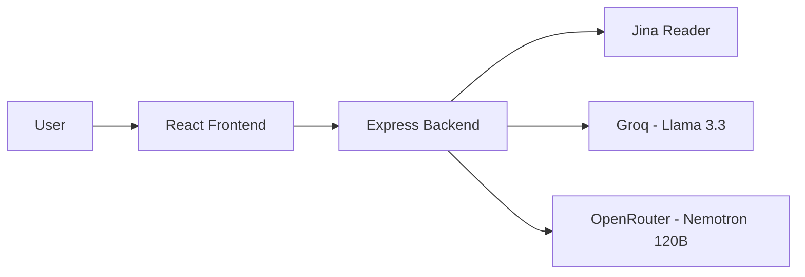
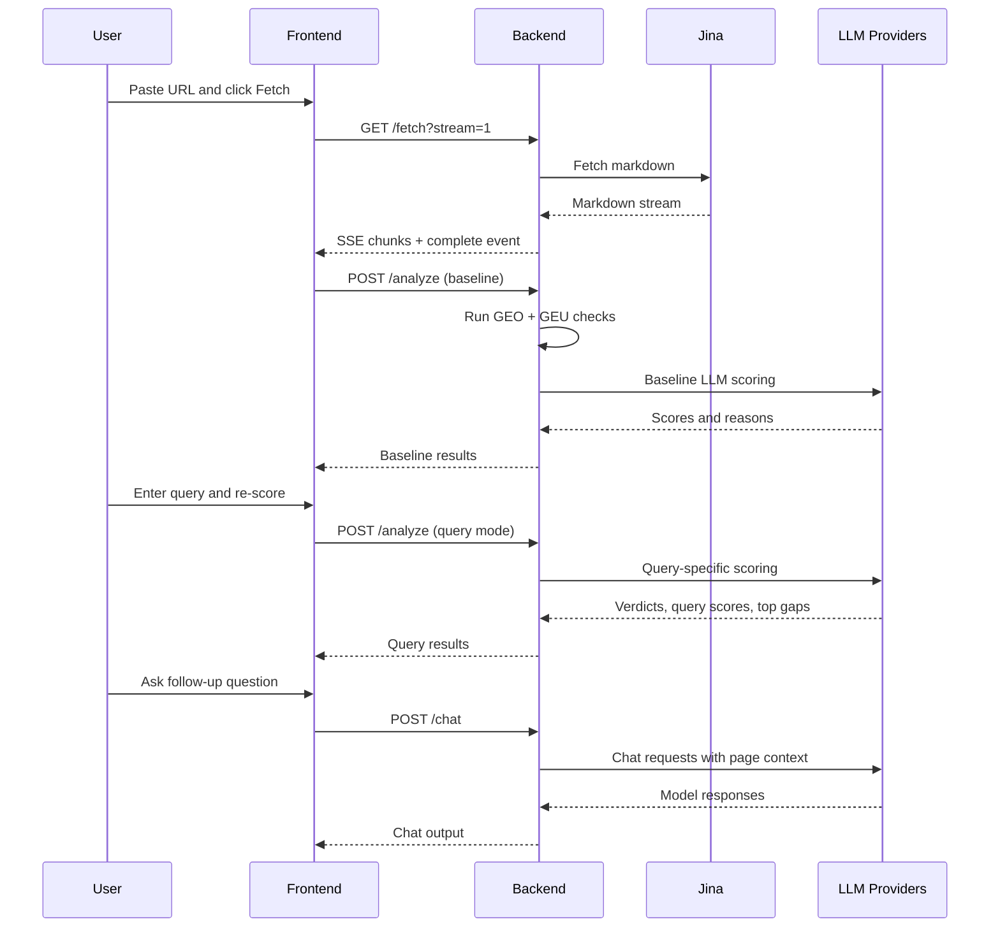

# System Architecture

## Overview

The AEO Pre-Publish Scorer is a lightweight full-stack system with one frontend, one backend API, and three external service dependencies.

## Runtime Components

### Frontend

- React single-page app
- Vite dev/build tooling
- owns user flow, UI state, score display, verdicts, and chat interactions

### Backend

- Express API
- validates requests
- orchestrates fetch, scoring, and chat calls
- merges deterministic scoring with LLM outputs

### External Services

- **Jina**
  fetches live pages and returns markdown-friendly content
- **Groq**
  runs Llama 3.3 for baseline and query analysis
- **OpenRouter**
  runs Nemotron 120B for baseline and query analysis

## API Surface

### `GET /fetch`

Purpose:

- fetch a live page
- stream markdown chunks back to the UI
- probe `llms.txt` and `llms-full.txt`

Returns:

- markdown
- char count
- normalized URL
- source signal metadata

### `POST /analyze`

Two modes:

- **baseline mode**
  no query provided
- **query mode**
  query provided

Baseline mode returns:

- Content Score
- GEU Score
- LLM baseline score
- detailed checks
- LLM model readouts

Query mode returns:

- Content Score
- GEU Score
- preserved LLM baseline score
- Query Match score
- gap score
- verdicts
- model status

### `POST /chat`

Purpose:

- continue the workflow after scoring
- ask rewrite or optimization questions against the fetched page content

Returns:

- model responses from both providers when available

## Request Flow

## Scoring Architecture

### Rule-Based Layer

Implemented in:

- `backend/utils/geoScorer.js`
- `backend/utils/geuScorer.js`
- `backend/utils/contentSignals.js`

This layer is:

- deterministic
- fast
- explainable
- easy to test

### LLM Layer

Implemented in:

- `backend/routes/analyze.js`
- `backend/models.js`

This layer adds:

- holistic baseline judgment
- query-specific answer fit
- rewrite-oriented verdicts

## Design Decisions

- **SSE for fetch**
  keeps page ingestion visible and alive in the UI
- **two-model analysis**
  reduces dependence on one provider's perspective
- **baseline first, query second**
  keeps the workflow understandable
- **gap metric**
  uses `Content Score - Query Match Score`
- **chat after scoring**
  lets users turn findings into action quickly

## Current Constraints

- no database or saved history
- no auth or multi-user collaboration
- external-service dependency for fetch and model scoring
- single-page-at-a-time workflow

## Best Fit

This architecture is ideal for:

- a fast-moving product prototype
- a single-page decision workflow
- explainable scoring plus AI guidance

It is not yet optimized for:

- batch crawling
- long-running jobs
- persistent workspaces
- enterprise workflow management

